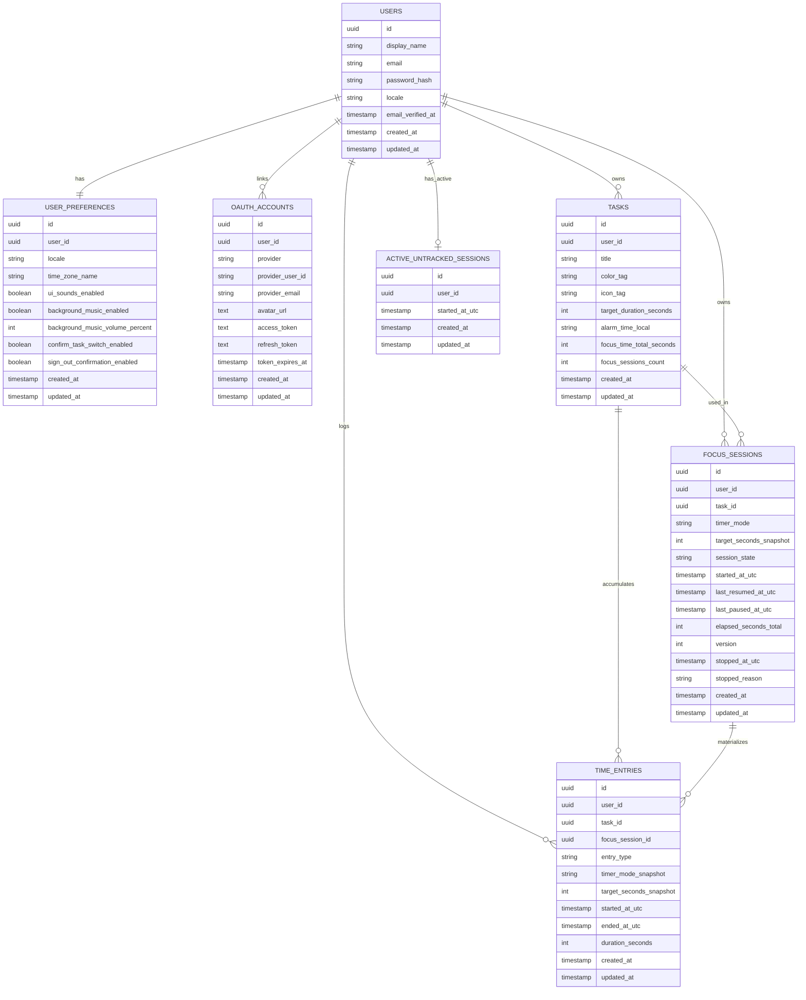

# VELOR - Modelo Global de BD (Notion)

## Regla Global de Documentacion

Cada nueva documentacion funcional debe reflejarse en este Mermaid ER global.

Regla operativa:
1. Si aparece una tabla nueva, se agrega aqui.
2. Si aparece una relacion nueva, se agrega aqui.
3. Este es el diagrama de referencia para BD global.

---

## Mermaid ER Global (BD)

---

## Cambios Aplicados (2026-03-02)

- Se agrego modulo de contador/sesiones + daily log al ER global.
- Se agregaron tablas `FOCUS_SESSIONS`, `ACTIVE_UNTRACKED_SESSIONS` y `TIME_ENTRIES`.
- Se agregaron relaciones de sesiones y registros de tiempo con `USERS` y `TASKS`.
