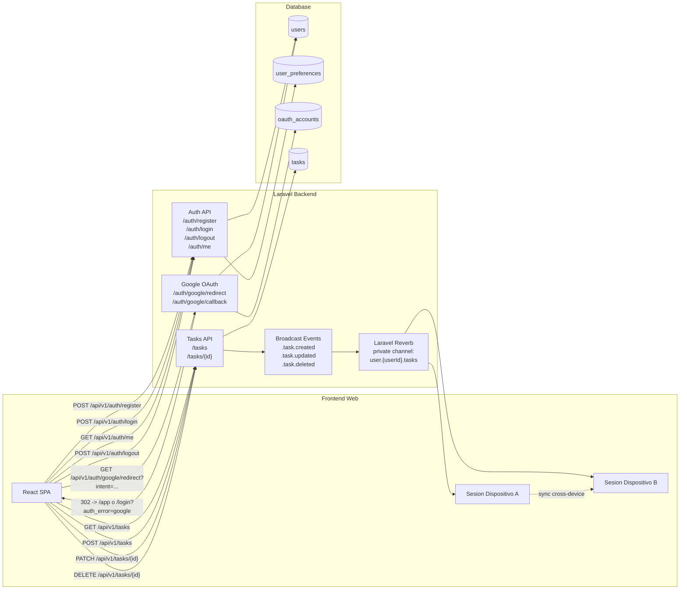

# VELOR - Modelo Global del Sistema (Notion)

## Regla Global de Documentacion

Cada nueva documentacion del funcionamiento del sistema debe actualizar este documento y su Mermaid global.

Regla operativa:
1. Si se agrega un modulo o flujo nuevo, se agrega nodo/relacion en Mermaid global.
2. Si se agrega una tabla nueva, se agrega en el Mermaid ER global.
3. Si se agrega un evento realtime nuevo, se agrega en la seccion de Reverb del Mermaid global.

---

## Modulos Cubiertos Hoy

- Auth (register/login/logout/me/google)
- Tasks (create/update/delete)
- Realtime de tasks entre sesiones del mismo usuario (Reverb)

---

## Mermaid Global (Arquitectura + Flujos)



---

## Mermaid ER Global (BD)

```mermaid
erDiagram
    USERS ||--|| USER_PREFERENCES : has
    USERS ||--o{ OAUTH_ACCOUNTS : links
    USERS ||--o{ TASKS : owns

    USERS {
        uuid id PK
        string display_name
        string email UK
        string password_hash
        string locale
        timestamp email_verified_at
        timestamp created_at
        timestamp updated_at
    }

    USER_PREFERENCES {
        uuid id PK
        uuid user_id FK_UK
        string locale
        string time_zone_name
        boolean ui_sounds_enabled
        boolean background_music_enabled
        int background_music_volume_percent
        boolean confirm_task_switch_enabled
        boolean sign_out_confirmation_enabled
        timestamp created_at
        timestamp updated_at
    }

    OAUTH_ACCOUNTS {
        uuid id PK
        uuid user_id FK
        string provider
        string provider_user_id
        string provider_email
        text avatar_url
        text access_token
        text refresh_token
        timestamp token_expires_at
        timestamp created_at
        timestamp updated_at
    }

    TASKS {
        uuid id PK
        uuid user_id FK
        string title
        string color_tag
        string icon_tag
        int target_duration_seconds
        string alarm_time_local
        int focus_time_total_seconds
        int focus_sessions_count
        timestamp created_at
        timestamp updated_at
    }
```

---

## Contratos Fuente

- Auth: `docs/backend/auth-contract-from-zero.md`
- Tasks: `docs/backend/tasks-contract-from-zero.md`
- ER auth simple: `docs/backend/db-auth-erd.md`

---

## Checklist para Futuras Actualizaciones

1. Crear/actualizar contrato del modulo (`*-contract-from-zero.md`).
2. Actualizar Mermaid global (arquitectura + flujos).
3. Actualizar Mermaid ER global (si hay cambios en BD).
4. Confirmar endpoints + eventos realtime en la misma version del documento.
